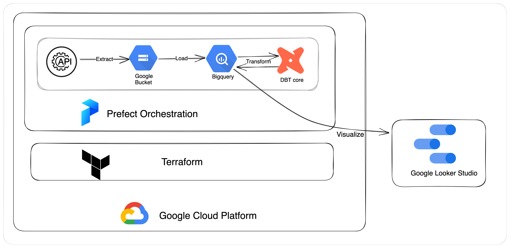
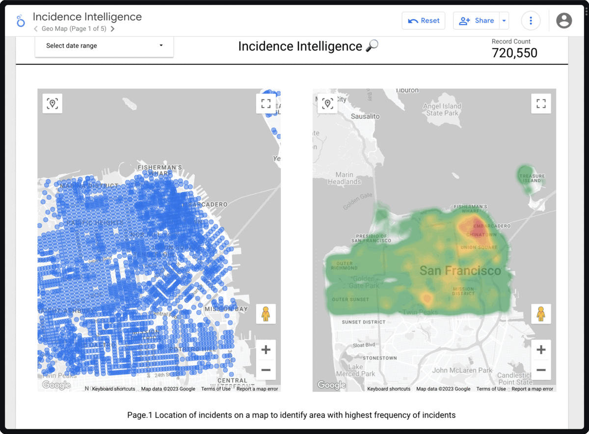

# Incidence Intelligence 🔎

A data pipeline that utilizes the ELT (Extract, Load, Transform) process to fetch, load, and transform San Francisco Police Department incident data, with the aim of generating insights.

## Description
As new incidents occur on a daily basis, I am attempting to gather insights that will enable us to take better measures. Specifically, I am seeking answers to the following questions:

[Dataset Link]()

1. What is the frequency of incidents over time?

2. Which incidents happen most frequently?

3. Which areas are hotspots of crime in San Francisco?

4. On which day and month do most incidents happen?

5. What are the trends of incidents in districts over the years?

6. How many active and closed cases are there?


## Tech Stack

**Infrastructure**: Terraform

**Cloud:** Google Cloud

**Data lake:** Google Cloud Storage

**Data warehouse:** BigQuery

**Orchestration:** Prefect

**Data transformation:** DBT

**Data visualization:** Google Looker Studio

## Architecture


Here is brief explanation: 
1. Using Google Cloud infrastructure
2. Setting it up using Terraform 
3. Extracting data from api servers
4. Ingesting it to google bucket 
5. Loading into Bigquery, with basic checks
6. DBT to transform
7. The whole process is being orchestrated by Prefect
8. Finally using Data Studio for Analytics

## Demo
[Live Demo](https://lookerstudio.google.com/reporting/9f6f2063-4f47-458c-bcf0-c15e2e905f92)




## Production table structure
| Column | Description | 
|--------|-------------|
|incident_datetime|	The date and time when the incident occurred|
|incident_date|	The date when the incident occurred|
|incident_time|	The time when the incident occurred|
|incident_year|	The year of the incident|
|incident_month|	The month of the incident (as a number)|
|incident_month_name|	The name of the month when the incident occurred|
|incident_day|	The day of the month when the incident occurred|
|incident_day_of_week|	The day of the week when the incident occurred|
|report_datetime|	The date and time when the incident was reported|
|incident_id|	A unique identifier for the incident|
|incident_number|	A unique identifier assigned to the incident by the reporting system|
|report_type_code|	A code representing the type of report made|
|report_type_description|	A description of the type of report made|
|incident_code|	A code representing the type of incident |
|incident_category|	The general category of the incident |
|incident_subcategory|	A more specific category of the incident|
|incident_description|	A brief description of the incident|
|resolution|	The outcome or resolution of the incident (e.g. arrest made, no further action)|
|police_district|	The police district in which the incident occurred|
|filed_online|	A string indicating whether the incident was reported online|
|intersection|	The intersection where the incident occurred|
|analysis_neighborhood|	The neighborhood in which the incident occurred, based on an analysis by the reporting system|
|supervisor_district|	The district number of the supervisor representing the area where the incident occurred|
|supervisor_district_name|	The name of the supervisor district where the incident occurred|
|supervisor_name|	The name of the supervisor representing the area where the incident occurred|
|latitude|	The latitude coordinate of the location where the incident occurred|
|longitude|	The longitude coordinate of the location where the incident occurred|
|geo_location|	A string containing both latitude and longitude coordinates of the location where the incident occurred|

Here is the lineage graph: 


## Installation

### Install Project
1. Make sure you have `docker`, `make` and `git` installed in your pc.
2. Git clone the repo  
   ```bash
   git clone https://github.com/rkscodes/incident_intelligence.git
   cd incident_intelligence
   ```
3. Make a virtual env with python=3.9 and install prefect: 
    ```bash
    conda create -n incidence python=3.9 prefect
    ```
4. Activate your env: 
      ``` bash
      conda activate incidence
      ```
5. Refer  [Setup Terraform](#setup-terraform) to setup cloud infra.
6. Make changes in `config.json` file with same details as in `variables.tf`.
7. Run prefect server: 
   ``` bash
   prefect server start
   ```
8. Register blocks and deployments using:
   ```bash
    make prefect_setup
   ```
9. Set prefect api url:
   ```bash
   prefect config set PREFECT_API_URL=http://127.0.0.1:4200/api
   ```
10. Run  docker Deployment `infra-docker-storage-docker` using prefect ui or:
      ```bash
      prefect deployment run parent-etl-flow/infra-docker-storage-docker
      ```
11. To run other deployment install all dependencies using: `make env_setup` (Tested on Mac, optional)

### Setup Terraform
<details>
   <summary> Show instructions </summary>

1. [Install terraform on your pc](https://developer.hashicorp.com/terraform/tutorials/gcp-get-started/install-cli)
2. Clone this (if not already): 
   ```bash
   git clone https://github.com/rkscodes/incident_intelligence.git
   cd incident_intelligence/terraform
   ```
3. Initialise terraform with : `terraform init`
4. Refer [Setup GCP](#setup-gcp) and follow all steps.
5. Update `project`  var in `variables.tf` with GCP project id.
6. Authenticate the service first:
   ```bash
   export GOOGLE_APPLICATION_CREDENTIALS={{path_to_application_credential}}
   gcloud auth activate-service-account --key-file ${GOOGLE_APPLICATION_CREDENTIALS}
   ```
7. Generate a SSH key using:
   ```bash
   ssh-keygen -t rsa -f ~/.ssh/<name> -C <username> -b 2048
   ```
8. Update `gce_ssh_user, gce_ssh_pub_key_file` variable in `variables.tf` with generated public key username and file path. 
9. Optionally could modify `region, zone, data_lake_bucket` if required
10. Please make sure you have exported:  
      ```bash
      export GOOGLE_APPLICATION_CREDENTIALS={{path_to_application_credential}}
      ```
11. `terraform validate`
12. `terraform plan`
13. `terraform apply`
14. Your infra should be up and running. 
15. One caveat if you decide to use `terraform destroy` VPC network are sometimes not destroyed so destroy `my-network` manually in google cloud ui. 

</details>

### Setup GCP
<details>
   <summary>Show Instructions</summary>

1. [Terraform reference for GCP](https://developer.hashicorp.com/terraform/tutorials/gcp-get-started/google-cloud-platform-build#set-up-gcp)
2. [Create GCP Account](https://console.cloud.google.com/freetrial/)
3. [Setup a GCP Project](https://console.cloud.google.com/projectcreate)
4. [Enable google compute api](https://console.developers.google.com/apis/library/compute.googleapis.com)
5. [Create a service account key](https://console.cloud.google.com/apis/credentials/serviceaccountkey)
</details>

## Roadmap

- [ ] Write unit test


## Acknowledgements
I would like to express my sincere gratitude to the team behind the [Data Engineering Zoomcamp](https://github.com/DataTalksClub/data-engineering-zoomcamp) course for providing me with the opportunity to enhance my skills in this field. The course has been an enriching and insightful experience, and I have gained a deeper understanding of the concepts and practices related to data engineering.

Additionally, I want to express my appreciation for the vibrant community on the course Slack channel. The discussions and interactions with fellow students have been an excellent source of support, and I have learned a great deal from their insights and experiences.

## License

[Apache License](LICENSE)

